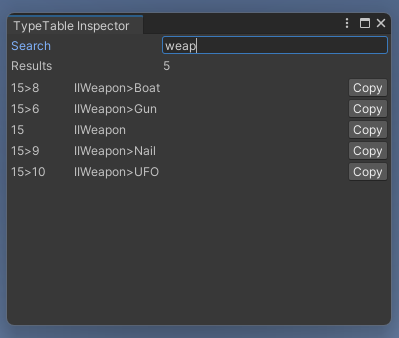

# TypeCache


When a project wants to iterate through types for a particular system, either the types are manually inserted, or theyre found at runtime in a "hands-off" automatic way.

This is to support the effort of making it "hands-off".
- To avoid ending up caching assemblies multiple times, or fetching them from `AppDomain` (basically wasted execution cycles).
- Acts as a central cache of types with an API for helping developers automate their designs, commonly:
  - Fetch types with an attribute
  - Fetch static methods with an attribute
  - Fetch types that implement an interface
  - Similar to [UnityEditor.TypeCache](https://docs.unity3d.com/ScriptReference/TypeCache.html)
- Relies on an asset that contains a list of assembly names
  - Automatically created, and made sure to always exist before play/builds
  - Will be in projects preloaded assets list
  - Assemblies that are missing from the list are automatically added
    - this only happens in editor, if project has never ran then it will remain empty until populated
- In builds, the `TypeCache` will only load the assemblies from the asset
  - Load time depends on the size of the assemblies (how many types to iterate through)
 
### Dependencies
- Access to `ReadOnlySpan<>`
  - Requires `System.Buffers` and `System.Memory` and `System.Runtime.CompilerServices.Unsafe`, all available in a sample

### Fetch all static methods with an attribute:
```cs
foreach ((MemberInfo member, Debug attribute) in TypeCache.GetMembersWithAttribute<Debug>())
{
    if (member is MethodInfo method && method.IsStatic) 
    {
        Debug.Log($"Method {method} has the debug attribute!");
    }
    else 
    {
        //could be a field, or a property too
    }
}
```

### Retrieve all types that implement an interface:
```cs
foreach (Type type in TypeCache.GetTypesAssignableFrom<IExample>())
{
    //could be another interface, could be abstract
    Debug.Log($"Type {type} implements the IExample interface!");
}
```

### Retrieve all types that strictly inherit from a class:
```cs
foreach (Type type in TypeCache.GetSubtypesOf<Component>())
{
    Debug.Log($"Type {type} is a component!");
}
```
### Create objects of type X:
```cs
foreach (Type type in TypeCache.GetTypesAssignableFrom<Mod>())
{
    if (type.IsAbstract || type.IsInterface) continue;

    Mod mod = (Mod)Activator.CreateInstance(type);
    Debug.Log($"Created mod {mod}!");
}
```

### Retrieve all types with an attribute:
```cs
foreach (Type type in TypeCache.GetTypesWithAttribute<Debug>())
{
    //could be class, or struct
    Debug.Log($"Type {type} has the debug attribute!");
}
```
